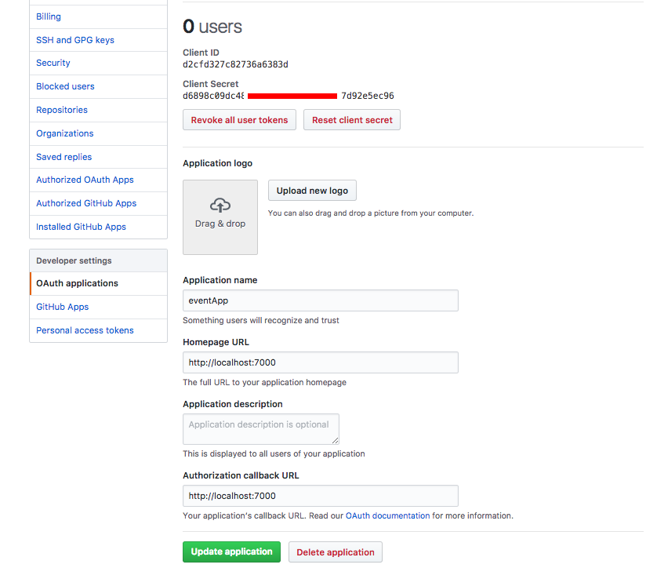
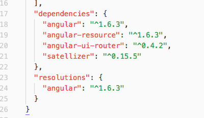
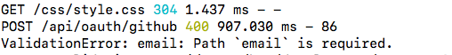
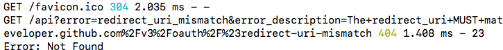

### Objectives
- Create an oAuth _**handshake**_ between an Express app and an oAuth provider.
- Access the user's profile, create a user record, and create a session cookie.

# oAuth with MEAN stack


### How it works
We'll be setting up an oAuth handshake using a package called Satellizer. There will be three big steps, that we can break down further to simplify the whole thing

- set up the app on GitHub
- set up the front end of our app
- set up the backend of our app


## Set up an app on GitHub

Click on your face on the top right, then from that menu find settings. On the settings page find `oAuth applications` and then `register a new` one - or similar. You can also manage an old app from here.

There are a few settings:

- Name : the name of your app, nothing special, choose a name!
- Homepage URL : `http://localhost:7000`
- description : nothing, or something, up to you
- callback URL : `http://localhost:7000`

click register and then you should be given a client ID and a client secret.




## frontend setup

OK well, lets assume you've already got a basic app going - if you want to add packages to the frontend better to use bower or yarn, you can use npm if you want. To keep it simple:

`$ bower i --save satellizer`

As this is an Angular app, you'll have some other things going on in the bower.json file 




### step 2

We'll need to configure the request, so:

`$ touch src/js/config/satellizer.js`

then:

```
angular
  .module('eventApp')
  .config(Auth);

Auth.$inject = ['$authProvider'];
function Auth($authProvider) {

  // for form based register and login
  $authProvider.signupUrl = '/api/register';
  $authProvider.loginUrl = '/api/login';

  // for github oAuth
  $authProvider.github({
    clientId: 'd2cfd327c82736a6383d', // change this for different apps
    url: '/api/oauth/github'
  });
}
```

The _clientId_ here is taken from github, note that it doesn't have to be kept secret, unlike the _client secret_.

### step 3

We'll be making our **login with github** request from the normal login page, that means we'll need a button on that page, and it will link to a function in our controller.

_src/js/controllers/login.js_

```
angular
  .module('githubAuth')
  .controller('LoginCtrl', LoginCtrl);

LoginCtrl.$inject = ['$auth', '$state'];
function LoginCtrl($auth, $state) {
  const vm = this;

  function authenticate(provider) {
    $auth.authenticate(provider)
      .then(() => $state.go('profile')); // where to go after login
  }

  vm.authenticate = authenticate;
}
```

And the button comes from the view

_src/js/views/login.html_
`<button ng-click="login.authenticate('github')">Sign in with GitHub</button>`


###lastly

last thing to remember is that you'll need to add satellizer to the app.js file, like so:

_src/app.js_

```
angular
  .module('githubAuth', ['ui.router', 'ngResource', 'satellizer']);
```


And that should be us done for the frontend


## backend setup

lets start with the packages that we'll need. Satellizer is already in the bower (or Yarn) file, but we still need some more things to get going:

_package.json_

```
  },
  "dependencies": {
    "bcrypt": "^1.0.2",  // for hashing passwords before saving in mongoDB
    "bluebird": "^3.5.0",  // for promises in node
    "body-parser": "^1.17.1", //changes a message body from giberish to JSON?
    "express": "^4.15.2",
    "jsonwebtoken": "^7.3.0",  // creating a JWT for each session
    "mongoose": "^4.8.6", // to use with MongoDB
    "morgan": "^1.8.1",  // makes a console.log of each request + details
    "request": "^2.81.0", // needed by request-promise
    "request-promise": "^4.2.0" // for making http calls from node
  },
```

### step 1

Lets start by configuring each oAuth provider we're using:

_config/oauth.js_

```
module.exports = {
  github: {
    loginURL: 'https://github.com/login/oauth/authorize',
    accessTokenURL: 'https://github.com/login/oauth/access_token',
    profileURL: 'https://api.github.com/user',
    clientId: process.env.eventApp_GITHUB_CLIENT_ID,
    clientSecret: process.env.eventApp_GITHUB_CLIENT_SECRET,
    scope: 'user:email'
  }
};
```


Note that the **clientId** is the same one we used in the front end setup, and the **clientSecret** is from github. To keep the clientSecret as a secret on the server we hold it in a process.env, and we do the same to the clientId for tidyness. Here, they need to be in the ~/.zshrc file as:

```
export eventApp_GITHUB_CLIENT_ID="d2cfd327c82736a6383d"
export eventApp_GITHUB_CLIENT_SECRET="ASDFGHJKL123456789QWERTYUIOP1234567890ZX"
```

then to reload the file, from terminal type: `$ source ~/.zshrc` in each of your terminal windows

finally type `$ env` and you should get a print of all environment variables including the new ones.


### step 2 
#### the controller

_controllers/oauth.js_

```
const rp = require('request-promise');
const config = require('../config/oauth');
const User = require('../models/user');
const jwt = require('jsonwebtoken');
const { secret } = require('../config/environment');

function github(req, res, next) {
  return rp({
    method: 'POST',
    url: config.github.accessTokenURL,
    qs: {
      client_id: config.github.clientId,
      client_secret: config.github.clientSecret,
      code: req.body.code
    },
    json: true
  })
  .then((token) => {
    return rp({
      method: 'GET',
      url: config.github.profileURL,
      qs: token,
      headers: {
        'User-Agent': 'Request-Promise'
      },
      json: true
    });
  })
  ...
```

- This is all from the satellizer docs, first make a POST request to GitHub, the response to that is `token`
- Then with the `token` make a GET request back to GitHub
- Because of the Config file, specifilcally `scope: email` we get an email address back from github.

#### unless

if the user doesn't have a public email address on github then you'll find one of these in the terminal:



If the user does have a public email available on GitHub then the controller continues with:

```
  .then((profile) => {
    return User
      .findOne({ email: profile.email })
      .then((user) => {
        if(!user) {
          user = new User({
            username: profile.login,
            email: profile.email
          });
        }

        user.githubId = profile.id;
        return user.save();
      });
  })
  .then((user) => {
    const token = jwt.sign({ userId: user.id }, secret, { expiresIn: '1hr' });
    return res.json({
      token,
      message: `Welcome back ${user.username}!`
    });
  })
  .catch(next);
}

module.exports = { github };
```

### step 3

back to our config folder:

_config/routes.js_

```
const router = require('express').Router();
.
.
.
// you'll need to add the contorller
const oauth = require('../controllers/oauth');
.
.
.
// and you need to handle the original POST request from the frontend
router.route('/oauth/github')
  .post(oauth.github);
...
```

note that the URL to handle the POST request is coming from the `src/js/config/satellizer.js` config file... `url: '/api/oauth/github'`


And that should be working! Test it now to make sure, but there is some tidy up to do to make it better.

#Tidy up

(all in the back end)

### the controller
_controllers/oauth.js_

If github returns an email address, then we try and add the github `profile.id` to our user model, like this:

```js
function github(req, res, next) {
  .
  .
  .then((profile) => {
    return User
      .findOne({ email: profile.email })
      .then((user) => {
        user.githubId = profile.id;    <------- this
        return user.save();				<----- and this.
      });
  })
```

That's fine if we have a user, but what if we don't. We will need to create a new user first:

```js
.
.
  .then((profile) => {
    return User
      .findOne({ email: profile.email })
      .then((user) => {
        if(!user) {						<--- if no user
          user = new User({			 <-- make a new user
            username: profile.login,	  <-- username
            email: profile.email			<--- email address
          });
        }
        
        user.githubId = profile.id;
        return user.save();
      });
  })
```


### The user model
we need to accept the new data in the userSchema _models/user.js_

```
const userSchema = new mongoose.Schema({
  username: { type: String, required: true },
  email: { type: String, required: true, unique: true },
  image: { type: String },
  password: { type: String },
  githubId: { type: Number }. <--------This!!
});
```

We also need to make the password optional, because we might make a new user from GitHub and we don't get a password... And, the email also has to be optional - in case the user doesn't have an email address on their github account.

```
const userSchema = new mongoose.Schema({
  username: { type: String, required: true },
  email: { type: String },
  image: { type: String },
  password: { type: String },
  githubId: { type: Number }
});
```

-- but we don't want to be able to save a user to the database with no information, so we make a pre-validate hook to run some checks.

```js
userSchema.pre('validate', function checkPassword(next) {
  if(!this.password && !this.githubId) {
    this.invalidate('password', 'required');
  }
  if(this.isModified('password') && this._passwordConfirmation !== this.password){
    this.invalidate('passwordConfirmation', 'does not match');
  }
  next();
});
```
Now the user either has to have a `password` **or** a `githubId` when registering.


### but

### The problem with email

Github will only give an email address if the user has made that information public. If not, the email address field will be blank. we've already made the email address optional in the userSchema, but now in the controller, for a returning user we need:

 to search for a user **_either_ by email, _or_ by their github id**:

```js
function github(req, res, next) {
  .
  .
  .then((profile) => {
    return User
      .findOne({ $or: [{ email: profile.email }, { githubId: profile.id }] })
      .then((user) => {
        if(!user) {
          user = new User({
            username: profile.login,
            email: profile.email
          });
        }
        
        user.githubId = profile.id;
        return user.save();
      });
.
.
```

Now we're **_really_** done!


## Conclusion

This is an example of how to set up oAuth for Github. oAuth always works in the same way, but the specific requests differ from provider to provider. If you want to roll out oAuth for Facebook or Twitter for example, you'll need to dive into their documentation.

[Github's oAuth documentation](https://developer.github.com/v3/oauth/).


## Errors

This is the GitHub app setup: the redirect URL is wrong. Change the Authorization callback URL

